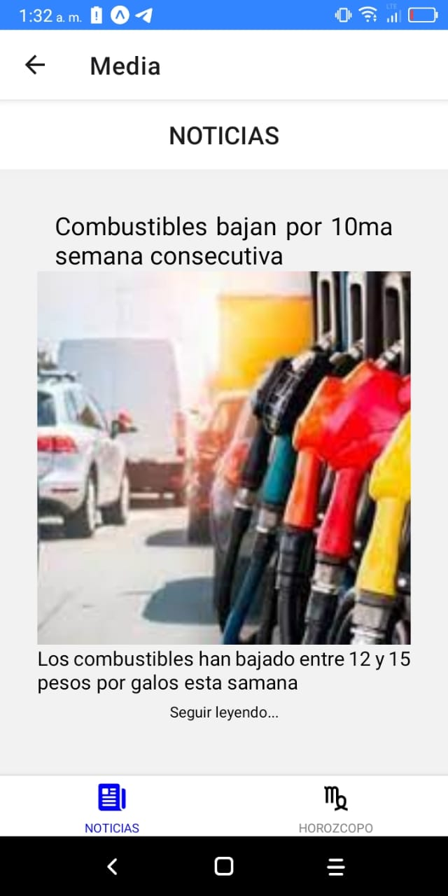
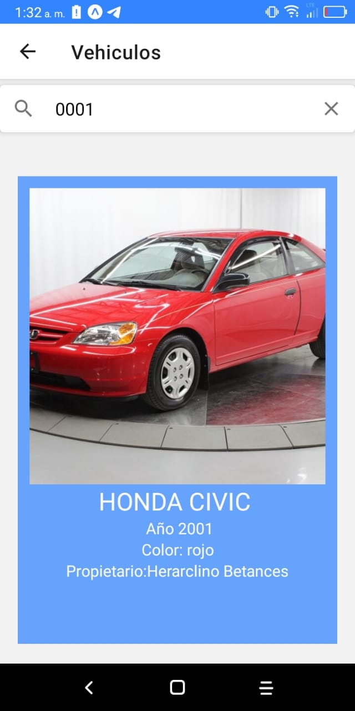

# Intranter
 Herramienta para uso de los amet en el campo de trabajo
## Funcionalidad
 - [x] Creado con React Native
 - [x] Typescript.
 - [x] Expo CLI
 
 ## Funcionalidad
 - [x] Aplicar multas
 - [x] Consulta de multas registradas.
 - [x] Consulta de conductores por licencia
 - [x] Consulta de vehiculos por placa
 - [x] Tarifario de multas
 - [x] Mapa de multas
 - [x] Estado del clima
 - [x] Noticias
 - [x] Horozcopo

   
 
  